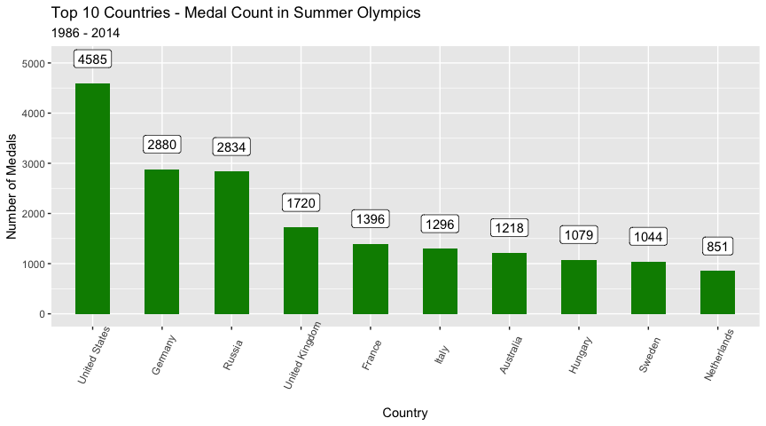
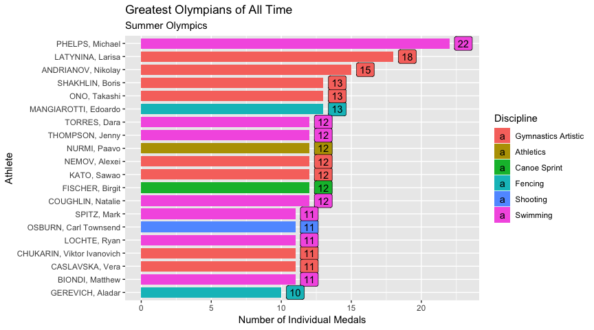
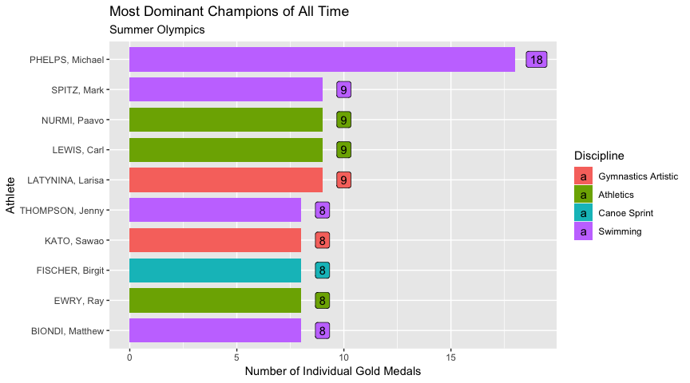

```r
library(ggplot2) # Data visualization
library(readr) # CSV file I/O, e.g. the read_csv function
library(dplyr)

list.files("../input")
```

```
## character(0)
```

```r
summer <- read.csv(file = '~/Desktop/DATASET/olympic-games/summer.csv')
winter <- read.csv(file='~/Desktop/DATASET/olympic-games/winter.csv')
dictionary <- read.csv('~/Desktop/DATASET/olympic-games/dictionary.csv', stringsAsFactors = F)
```
Replacing the country codes in summer with the country names

```r
s.olympics <- tbl_df(summer) %>%
    rename(Code = Country) %>%
    left_join(., dictionary, by = 'Code')

colSums(is.na(s.olympics))
```

```
##           Year           City          Sport     Discipline        Athlete 
##              0              0              0              0              0 
##           Code         Gender          Event          Medal        Country 
##              0              0              0              0           5423 
##     Population GDP.per.Capita 
##           5469           6023
```
There are 5423 values of Code that do not have corresponding countries. Lets check the missing country values.

```r
missing.country <- s.olympics %>% filter(is.na(Country)) %>% select(Code) %>% distinct(Code)
```

```
## Warning: package 'bindrcpp' was built under R version 3.4.4
```

```r
missing.country
```

```
## # A tibble: 19 x 1
##    Code 
##    <chr>
##  1 ZZX  
##  2 BOH  
##  3 ANZ  
##  4 RU1  
##  5 TCH  
##  6 YUG  
##  7 ROU  
##  8 URS  
##  9 EUA  
## 10 BWI  
## 11 GDR  
## 12 FRG  
## 13 EUN  
## 14 IOP  
## 15 SRB  
## 16 ""   
## 17 TTO  
## 18 MNE  
## 19 SGP
```
Adding correct values from Wikipedia (https://en.wikipedia.org/wiki/List_of_IOC_country_codes)

```r
missing.country <- cbind(missing.country, 
c('Mixed', 'Czech Republic', 'Australia', 'Russia', 'Czech Republic', 'Mixed', 
'Romania', 'Russia', 'Germany', 'West Indies', 'Germany', 'Germany', 'Mixed',
'Independents', 'Serbia', 'Independents', 'Independents', 'Montenegro', 'Singapore'))

colnames(missing.country) <- c('Code', 'Country')
missing.country <- missing.country %>% mutate(Population = '', GDP.per.Capita = '') %>% select(Code, Country, Population, GDP.per.Capita)
```
Updating the original data

```r
dictionary <- rbind(dictionary, missing.country)

s.olympics <- tbl_df(summer) %>%
    rename(Code = Country) %>%
    left_join(., dictionary, by = 'Code')
```

```
## Warning: Column `Code` joining factor and character vector, coercing into
## character vector
```

```r
colSums(is.na(s.olympics))
```

```
##           Year           City          Sport     Discipline        Athlete 
##              0              0              0              0              0 
##           Code         Gender          Event          Medal        Country 
##              0              0              0              0              0 
##     Population GDP.per.Capita 
##             46            600
```
I have taken a few liberties while preparing the data to make my work easier; for example, Soviet Union has been added as 'Russia' even though it contained many countries that later became independent.

Some factors are repeated. So, lets remove the redundant values

```r
s.olympics$Discipline <- plyr::mapvalues(s.olympics$Discipline, 
                c('Artistic G.', 'Wrestling Gre-R', 'Croquet',
                  'Wrestling Free.', 'Water polo', 'Water Motorspor',
                  'Modern Pentath.', 'Canoe / Kayak F', 'BMX',
                  'Canoe / Kayak S', 'Synchronized S.', 'Rhythmic G.',
                  'Beach volley.'), 
                c('Gymnastics Artistic', 'Wrestling Greco-Roman', 'Roque',
                  'Wrestling Freestyle', 'Water Polo', 'Water Motorsport',
                  'Modern Pentathlon', 'Canoe Sprint', 'Cycling BMX',
                  'Canoe Slalom', 'Synchronized Swimming', 'Gymnastics Rhythmic',
                  'Beach Volleyball'))
s.olympics$Sport <- plyr::mapvalues(s.olympics$Sport, 
                                    c('Croquet', 'Canoe / Kayak'), 
                                    c('Roque', 'Canoe'))
```


Now that the data preparation is complete, lets explore!

### Top 10 countries by medals in Summer Olympics
Lets find out the top 10 countries based on number of medals won by the country.


```r
top10.countries <- s.olympics %>% 
    group_by(Country) %>%
    mutate(medal.count = n()) %>%
    select(Country, medal.count) %>%
    distinct(Country, medal.count) %>%
    arrange(desc(medal.count)) %>%
    head(10)

# top10.countries

ggplot(data = top10.countries, 
       aes(x = reorder(Country, -medal.count), y = medal.count)) +
    geom_bar(stat = 'identity', width = 0.5, fill = 'green4') +
    geom_label(aes(label = medal.count), nudge_y = 500) +
    labs(title = 'Top 10 Countries - Medal Count in Summer Olympics',
         subtitle = '1986 - 2014') +
    xlab('Country') +
    ylab('Number of Medals') +
    theme(axis.text.x = element_text(angle = 65, vjust = 0.7))
```

<!-- -->


### Greatest Olympians of All Time (Summer Olympics)
Lets find out the top 20 athletes in Summer Olympics history based on number of individual medals won.


```r
top20.athletes <- tbl_df(s.olympics) %>%
    group_by(Athlete) %>%
    mutate(medal.count = n()) %>%
    select(Athlete, medal.count, Discipline) %>%
    distinct(Athlete, medal.count, Discipline) %>%
    arrange(desc(medal.count)) %>%
    head(20)

# top20.athletes

ggplot(top20.athletes, 
       mapping = aes(x = reorder(Athlete, medal.count), 
                     y = medal.count, 
                     fill = Discipline)) +
    geom_bar(stat = 'identity', width = 0.8) +
    geom_label(aes(label = medal.count), nudge_y = 1) +
    coord_flip() +
    labs(title = 'Greatest Olympians of All Time', 
         subtitle = 'Summer Olympics') +
    ylab('Number of Individual Medals') +
    xlab('Athlete') 
```

<!-- -->

As you can see Michael Phelps leads as all time highest medal winner.

### Most Dominant Champions
Lets find the top 10 athelets with most gold medals in Summer Olympics history.


```r
top10.champions <- s.olympics %>%
    filter(Medal == 'Gold') %>%
    group_by(Athlete) %>%
    mutate(medal.count = n()) %>%
    select(Athlete, medal.count, Discipline) %>%
    distinct(Athlete, medal.count, Discipline) %>%
    arrange(desc(medal.count)) %>%
    head(10)

# top10.champions

ggplot(top10.champions, 
       mapping = aes(x = reorder(Athlete, medal.count), 
                     y = medal.count,
                     fill = Discipline)) +
    geom_bar(stat = 'identity', width = 0.8) +
    geom_label(aes(label = medal.count), nudge_y = 1) +
    coord_flip() +
    labs(title = 'Most Dominant Champions of All Time', 
         subtitle = 'Summer Olympics') +
    ylab('Number of Individual Gold Medals') +
    xlab('Athlete')    
```

<!-- -->

Michael Phelps crushes all competition here (and he won even more medals in 2016).

### Most Profitable Sports
Lets find the top 5 sports which have produced the highest number of medals.


```r
top5.sports <- s.olympics %>%
    group_by(Sport) %>%
    mutate(medal.count = n()) %>%
    select(Sport, medal.count) %>%
    distinct(Sport, medal.count) %>%
    arrange(desc(medal.count)) %>%
    head(5)

top5.sports
```

```
## # A tibble: 5 x 2
## # Groups:   Sport [5]
##   Sport      medal.count
##   <fct>            <int>
## 1 Aquatics          4170
## 2 Athletics         3638
## 3 Rowing            2667
## 4 Gymnastics        2307
## 5 Fencing           1613
```

Aquatics has highest number of medals; probably because it has more number of events at Olympics than any other sport.
