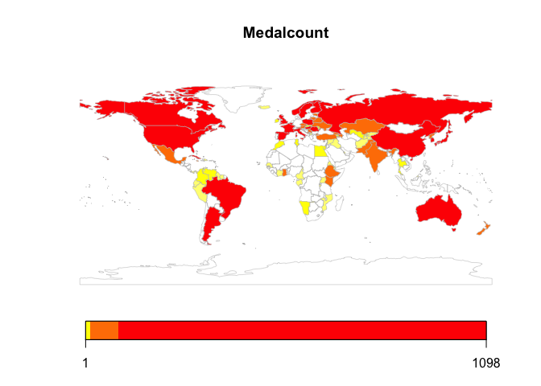
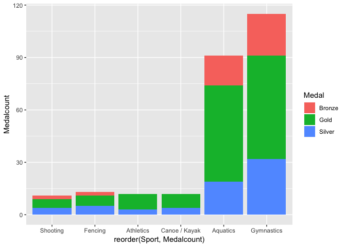

## R Markdown

This is an R Markdown document. Markdown is a simple formatting syntax for authoring HTML, PDF, and MS Word documents. For more details on using R Markdown see <http://rmarkdown.rstudio.com>.

When you click the **Knit** button a document will be generated that includes both content as well as the output of any embedded R code chunks within the document. You can embed an R code chunk like this:


```
## Warning: package 'ggplot2' was built under R version 3.4.4
```

```
## Loading required package: sp
```

```
## Warning: package 'sp' was built under R version 3.4.4
```

```
## ### Welcome to rworldmap ###
```

```
## For a short introduction type : 	 vignette('rworldmap')
```

```
## Warning: package 'repr' was built under R version 3.4.4
```

## Including Plots

You can also embed plots, for example:


```
##   Year   City    Sport Discipline               Athlete Country Gender
## 1 1896 Athens Aquatics   Swimming         HAJOS, Alfred     HUN    Men
## 2 1896 Athens Aquatics   Swimming      HERSCHMANN, Otto     AUT    Men
## 3 1896 Athens Aquatics   Swimming     DRIVAS, Dimitrios     GRE    Men
## 4 1896 Athens Aquatics   Swimming    MALOKINIS, Ioannis     GRE    Men
## 5 1896 Athens Aquatics   Swimming    CHASAPIS, Spiridon     GRE    Men
## 6 1896 Athens Aquatics   Swimming CHOROPHAS, Efstathios     GRE    Men
##                        Event  Medal
## 1             100M Freestyle   Gold
## 2             100M Freestyle Silver
## 3 100M Freestyle For Sailors Bronze
## 4 100M Freestyle For Sailors   Gold
## 5 100M Freestyle For Sailors Silver
## 6            1200M Freestyle Bronze
```

```
## 'data.frame':	31165 obs. of  9 variables:
##  $ Year      : int  1896 1896 1896 1896 1896 1896 1896 1896 1896 1896 ...
##  $ City      : Factor w/ 22 levels "Amsterdam","Antwerp",..: 3 3 3 3 3 3 3 3 3 3 ...
##  $ Sport     : Factor w/ 43 levels "Aquatics","Archery",..: 1 1 1 1 1 1 1 1 1 1 ...
##  $ Discipline: Factor w/ 67 levels "Archery","Artistic G.",..: 50 50 50 50 50 50 50 50 50 50 ...
##  $ Athlete   : Factor w/ 22762 levels "AABYE, Edgar",..: 7412 8021 4894 12438 3157 3339 7412 503 3339 14271 ...
##  $ Country   : Factor w/ 148 levels "","AFG","AHO",..: 60 9 54 54 54 54 60 54 54 9 ...
##  $ Gender    : Factor w/ 2 levels "Men","Women": 1 1 1 1 1 1 1 1 1 1 ...
##  $ Event     : Factor w/ 666 levels "- 47.63KG (Flyweight)",..: 79 79 80 80 80 105 105 105 162 162 ...
##  $ Medal     : Factor w/ 3 levels "Bronze","Gold",..: 2 3 1 2 3 1 2 3 1 2 ...
```


```
## Warning: package 'maps' was built under R version 3.4.4
```

```
## 
## Attaching package: 'maps'
```

```
## The following object is masked from 'package:plyr':
## 
##     ozone
```

```
## 209 codes from your data successfully matched countries in the map
## 140 codes from your data failed to match with a country code in the map
## 159 codes from the map weren't represented in your data
```

```
## You asked for 7 quantiles, only 4 could be created in quantiles classification
```

<!-- -->
<!-- -->
<!-- -->
<!-- -->
<!-- -->
<!-- -->

<!-- -->
Note that the `echo = FALSE` parameter was added to the code chunk to prevent printing of the R code that generated the plot.
